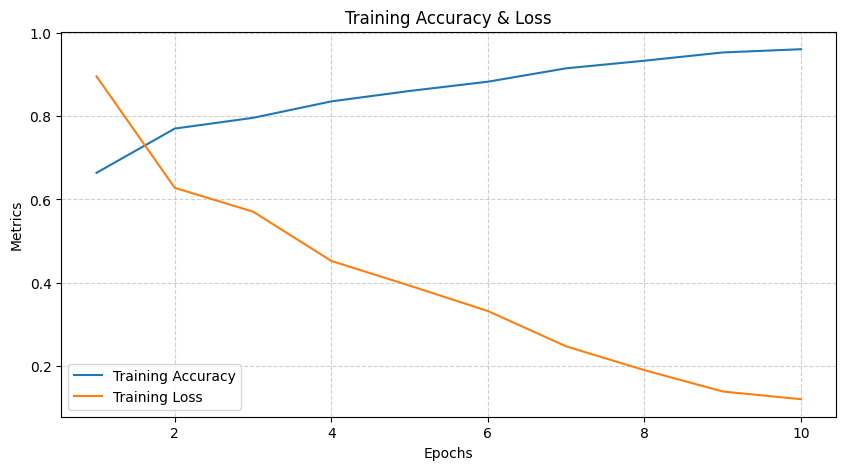

[](https://git.io/typing-svg)


---

> **TL;DR:**  
> This project implements **Convolutional Neural Networks (CNNs)** for classifying natural and man-made scenes from the **Intel Image Dataset**.  
> It compares two models — a **VGG19 Transfer Learning CNN** and a **Custom CNN trained from scratch** — to evaluate their performance on real-world scene recognition tasks.

---

[](https://git.io/typing-svg)

- 🧠 <a href="#installation">Project Overview</a>
- ✨ <a href="#features">Features</a>
- 🧰 <a href="#tech-stack">Technologies & Tools</a>
- 🗂 <a href="#dataset">Dataset</a>
- 🚀 <a href="#getting-started">Getting Started</a>
    - 🔧 Prerequisites
    - ⚙️ Installation
    - ▶️ Usage
- 🏗 <a href="#model-architectures">Model Architectures</a>
- 📊 <a href="#results">Results & Comparison</a>
    - 🔹 Key Observation
    - 📈 Graphs of Training Loss & Accuracy
- 📁 <a href="#project-structure">Project Structure</a>
- 📜 <a href="#license">License</a>

---

<!-- Project Overview -->
<a id="project-overview"></a>
[](https://git.io/typing-svg) <br>
This project focuses on developing and evaluating **Convolutional Neural Networks (CNNs)** for the classification of images from the **Intel Image Dataset**.

The dataset consists of images categorized into six distinct classes:
<br>
🏢 **Buildings** | 🌲 **Forest** | 🏔 **Glacier** | ⛰ **Mountain** | 🌊 **Sea** | 🛣 **Street**

Two different approaches are implemented to assess performance and effectiveness:

1. **CNN Model with Transfer Learning** – A model leveraging **VGG19**, a pre-trained deep learning architecture, to enhance feature extraction and improve classification accuracy.
2. **CNN Model Trained from Scratch** – A custom-built convolutional neural network trained without any pre-existing weights.

---

<!-- Features -->
<a id="features"></a>
[](https://git.io/typing-svg)

- **Deep Learning Model:** CNN-based classifier implemented using TensorFlow/Keras.
- **Transfer Learning:** Uses VGG19 as the pre-trained model for improved accuracy.
- **Performance Metrics:** Evaluates accuracy, precision, recall, and confusion matrix.
- **Modular Code Structure:** Well-organized for easy modification and experimentation.

---

<!-- Technologies and Tools Used -->
<a id="tech-stack"></a>
[](https://git.io/typing-svg)
- **IDE:** Jupyter Lab
- **Programming Language:** Python
- **Deep Learning Framework:** TensorFlow/Keras
- **Data Processing:** OpenCV, NumPy, Pandas
- **Visualization:** Matplotlib, Seaborn
- **Hardware Acceleration:** GPU (CUDA-enabled for TensorFlow)

---

<!-- Dataset -->
<a id="dataset"></a>
[](https://git.io/typing-svg)

The **Intel Image Dataset** consists of images categorized into six natural and man-made scenery classes. It is a widely used benchmark dataset for scene recognition and classification tasks. The dataset is structured into training, validation, and test sets to facilitate model evaluation.

### **Dataset Structure**
- **Train Set:** 14,034 images  
- **Test Set:** 3,000 images  
- **Prediction Set:** 7,301 images  

> [!TIP]
> You can download the dataset from here: [Intel Image Classification Dataset](https://www.kaggle.com/datasets/puneet6060/intel-image-classification)

---

<!-- Getting Started -->
<a id="getting-started"></a>
[](https://git.io/typing-svg)

### **🔧 Prerequisites**
> [!IMPORTANT]
> - Ensure Anaconda is installed, if not you can download from [Anaconda](https://www.anaconda.com/download/success) and also Git (if not available, download from [Github](https://git-scm.com/downloads)).
> - Also download the mentioned dataset before running any of the notebooks, and change the paths in the notebooks whereever necessary.

### **⚙️ Installation**
Once Anaconda is installed, open the Anaconda Prompt and run the following commands:

1. Clone the repository:
```bash
git clone https://github.com/NSANTRA/Intel-CNN-Image-Classification
```

2. Navigate to the project directory:
```bash
cd Intel-CNN-Image-Classification
```

3. Create a new Conda environment:
```bash
conda env create -f "Tensorflow.yml"
```

4. Activate the environment:
```bash
conda activate Tensorflow
```

### **▶️ Usage**

After activating the environment:
- Open Jupyter Notebook or JupyterLab within the environment.
- Navigate to the project folder and open the desired notebook.
- Ensure dataset paths are correctly configured in each notebook.
- Run the cells sequentially to execute the project.

---

<!-- Model Architectures -->
<a id="model-architectures"></a>
[](https://git.io/typing-svg)

### **1️⃣ CNN Model with Transfer Learning (VGG19)**  

| Layer (Type)                                   | Output Shape      | Parameters |
|------------------------------------------------|-------------------|------------|
| vgg19 (Functional)                             | (None, 4, 4, 512) | 20,024,384 |
| flatten_2 (Flatten)                            | (None, 8192)      | 0          |
| dense_8 (Dense)                                | (None, 512)       | 4,194,816  |
| batch_normalization_6 (BatchNormalization)     | (None, 512)       | 2,048      |
| dense_9 (Dense)                                | (None, 256)       | 131,328    |
| batch_normalization_7 (BatchNormalization)     | (None, 256)       | 1,024      |
| dense_10 (Dense)                               | (None, 128)       | 32,896     |
| batch_normalization_8 (BatchNormalization)     | (None, 128)       | 512        |
| dense_11 (Dense)                               | (None, 6)         | 774        |

- **Non-Trainable Parameters**: 20,026,176
- **Trainable Parameters**: 4,361,606
- **Total Parameters**: 24,387,782

- **Optimizer:** Adam
- **Loss Function:** Sparse Categorical Crossentropy

### **2️⃣ CNN Model (Trained from Scratch)**  

| Layer (Type)                               | Output Shape         | Parameters |
|--------------------------------------------|----------------------|------------|
| conv2d (Conv2D)                            | (None, 150, 150, 64) | 1,792      |
| batch_normalization (BatchNormalization)   | (None, 150, 150, 64) | 256        |
| conv2d_1 (Conv2D)                          | (None, 150, 150, 64) | 36,928     |
| batch_normalization_1 (BatchNormalization) | (None, 150, 150, 64) | 256        |
| max_pooling2d (MaxPooling2D)               | (None, 75, 75, 64)   | 0          |
| conv2d_2 (Conv2D)                          | (None, 75, 75, 128)  | 73,856     |
| batch_normalization_2 (BatchNormalization) | (None, 75, 75, 128)  | 512        |
| conv2d_3 (Conv2D)                          | (None, 75, 75, 128)  | 147,584    |
| batch_normalization_3 (BatchNormalization) | (None, 75, 75, 128)  | 512        |


- **Non-trainable Parameters:** 1,216  
- **Trainable Parameters:** 22,701,734  
- **Total Parameters:** 22,702,950  
  
- **Optimizer:** Adam  
- **Loss Function:** Sparse Categorical Crossentropy  

---

<!-- Results & Comparison -->
<a id="results"></a>
[](https://git.io/typing-svg)

### **Classification Report for CNN With Transfer Learning**

|                  | Precision | Recall | F1-Score | Support |
|------------------|-----------|--------|----------|---------|
| **Buildings**    |    0.92   |  0.89  |   0.91   |   437   |
| **Forest**       |    0.96   |  0.99  |   0.98   |   474   |
| **Glacier**      |    0.83   |  0.80  |   0.82   |   553   |
| **Mountain**     |    0.82   |  0.83  |   0.82   |   525   |
| **Sea**          |    0.93   |  0.91  |   0.92   |   510   |
| **Street**       |    0.89   |  0.93  |   0.91   |   501   |
|                  |           |        |          |         |
| *accuracy*       |           |        |   0.89   |   3000  |
| *macro avg*      |    0.89   |  0.89  |   0.89   |   3000  |
| *weighted avg*   |    0.89   |  0.89  |   0.89   |   3000  |

#### **🔹 Key Observations:**
- ✅ **High Overall Accuracy:** 89% – The model performs well across all classes.
- ✅ Forest category has the highest accuracy (**Precision: 0.96**, **Recall: 0.99**, **F1-score: 0.98**) – Very few misclassifications.
- ✅ Buildings, Sea, and Street categories also perform well (**F1-score: ~0.91**).
- ✅ Glacier and Mountain have the lowest scores (**F1-score: ~0.82**) – These categories are harder to classify correctly.

#### **Class-Wise Weights**
|     Category     | Precision | Recall | F1-Score | Observations                                               |
|------------------|-----------|--------|----------|------------------------------------------------------------|
| **Buildings**    |    0.92   |  0.89  |   0.91   |   Some Buildings misclassified as Streets.                 |
| **Forest**       |    0.96   |  0.99  |   0.98   |   Best performing class – almost perfect classification.   |
| **Glacier**      |    0.83   |  0.80  |   0.82   |   Some Glaciers misclassified as Mountains.                |
| **Mountain**     |    0.82   |  0.83  |   0.82   |   Often confused with Glaciers.                            |
| **Sea**          |    0.93   |  0.91  |   0.92   |   Often confused with Glaciers.                            |
| **Street**       |    0.89   |  0.93  |   0.91   |   Often confused with Glaciers.                            |

#### **🔹 Key Takeaways:**
- 📌 Transfer Learning significantly boosts accuracy, with an **overall F1-score of 0.89**.
- 📌 Forest classification is near-perfect, while Glacier and Mountain have the most confusion.
- 📌 Further improvements can be made by refining the model’s ability to differentiate Glaciers and Mountains.

---

###  **Confusion Matrices**
#### **CNN With Transfer Learning**

<br>

**Key Observations:**
- ✅ High overall accuracy, fewer misclassifications compared to the second model.
- ✅ Forest category is nearly perfect – 468 out of 474 correctly classified.
- ✅ Buildings misclassified mainly as Streets (43 cases) – likely due to urban similarities.
- ✅ Glacier vs. Mountain confusion – 69 Glacier images misclassified as Mountains.
- ✅ Minimal errors in the Sea category – 465 out of 510 correctly classified.

**Major Misclassifications:**
- Glacier mistaken as Mountain (69 cases) – Snow-covered landscapes might be confusing.
- Street misclassified as Buildings (43 cases) – Similar structures in urban settings.
- Sea occasionally confused with Glacier & Mountain – Landscape similarities.

**Takeaway:**
- 🔥 Transfer Learning improves classification significantly, but Glacier vs. Mountain remains a challenge.

#### **CNN From Sratch**

<br>

**Key Observations:**
- ❌ Lower overall accuracy – More misclassifications across most categories.
- ❌ Glacier category struggles the most – 99 Glaciers classified as Mountains (compared to 69 in TL model).
- ❌ Buildings misclassified as Streets (67 cases) – Worse than Transfer Learning model (43 cases).
- ✅ Forest category still performs well – 453 correctly classified out of 474.
- ❌ Sea and Mountain confusion is more frequent than in the Transfer Learning model.

**Major Misclassifications:**
- Glacier confused with Mountain (99 cases) – Worse than Transfer Learning model.
- Street misclassified as Buildings (41 cases) – A bit better than the TL model but still a concern.
- Sea misclassified as Glacier (16 cases) – More than in the TL model.

**Takeaway:**
- 🚨 Training from scratch struggles more, particularly with Glacier-Mountain and Sea-Glacier distinctions. Transfer Learning is clearly more effective for this task.

#### **Summary**
**Key Observations and Comparison**
|Metric                   |Transfer Learning CNN                               |CNN From Scratch                                     |
|-------------------------|----------------------------------------------------|----------------------------------------------------|
|**Overall Accuracy**     |Higher (Fewer misclassifications)                   |Lower (More misclassifications)                     |
|**Buildings Accuracy**   |391 correctly classified, 43 misclassified as Street|351 correctly classified, 67 misclassified as Street|
|**Forest Accuracy**      |468 correctly classified, almost no errors          |453 correctly classified, some errors               |
|**Glacier vs. Mountain** |69 Glaciers misclassified as Mountains              |99 Glaciers misclassified as Mountains (worse)      |
|**Sea vs. Mountain**     |Few misclassifications                              |More confusion between Sea and Mountain             |
|**Street vs. Buildings** |Some confusion but better handling                  |More Streets misclassified as Buildings             |

**Key Takeaways**
- ✅ Transfer Learning performs better overall
- ✅ CNN from Scratch struggles more with Glacier & Mountain misclassifications
- ✅ Transfer Learning model has more confident predictions, fewer mixed-up cases
- ✅ Fine-tuning the CNN from Scratch might improve its performance

---

###  **📈 Graphs of Training Loss and Accuracy**
#### **CNN With Transfer Learning**


#### **CNN Without Transfer Learning**


---

<!-- Project Structure -->
<a id="project-structure"></a>
[](https://git.io/typing-svg)

```tree
Intel-CNN-Image-Classification/
├── Dataset/                                             # Intel Image Dataset
│   └── seg_train/                                       # Training Images
│   └── seg_test/                                        # Testing Images
│   └── seg_pred/                                        # Unlabeled Images                                    
├── Models/                                              # Saved Models (.h5 files)
│   └── Model With Transfer Learning.h5
│   └── Model Without Transfer Learning.h5
├── Notebooks/                                           # Jupyter Notebooks for training & evaluation
│   └── Classification With Transfer Learning.ipynb
│   └── Classification Without Transfer Learning.ipynb
├── requirements.txt                                     # Required Dependencies
├── README.md                                            # Project Documentation
└── .gitignore                                           # Git Ignore File
```

---

<!-- License -->
<a id="license"></a>
[](https://git.io/typing-svg)
MIT License

Copyright (c) 2025 Neelotpal Santra

Permission is hereby granted, free of charge, to any person obtaining a copy
of this software and associated documentation files (the "Software"), to deal
in the Software without restriction, including without limitation the rights
to use, copy, modify, merge, publish, distribute, sublicense, and/or sell
copies of the Software, and to permit persons to whom the Software is
furnished to do so, subject to the following conditions:

The above copyright notice and this permission notice shall be included in all
copies or substantial portions of the Software.

THE SOFTWARE IS PROVIDED "AS IS", WITHOUT WARRANTY OF ANY KIND, EXPRESS OR
IMPLIED, INCLUDING BUT NOT LIMITED TO THE WARRANTIES OF MERCHANTABILITY,
FITNESS FOR A PARTICULAR PURPOSE AND NONINFRINGEMENT. IN NO EVENT SHALL THE
AUTHORS OR COPYRIGHT HOLDERS BE LIABLE FOR ANY CLAIM, DAMAGES OR OTHER
LIABILITY, WHETHER IN AN ACTION OF CONTRACT, TORT OR OTHERWISE, ARISING FROM,
OUT OF OR IN CONNECTION WITH THE SOFTWARE OR THE USE OR OTHER DEALINGS IN THE
SOFTWARE.
